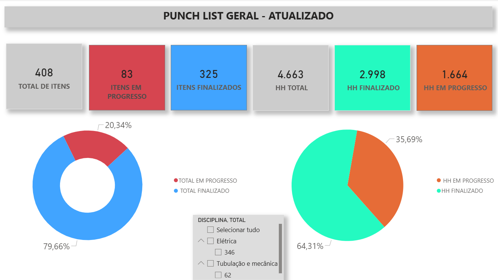

# 📊 Dashboard - Punch List geral com base nas disciplinas de Elétrica e Tubulação

Dashboard desenvolvido em Power BI com foco no acompanhamento de progresso físico e controle de horas (HH) em atividades de obra industrial.

---

## 📌 Sobre o Projeto

Este projeto tem como objetivo transformar dados operacionais em informações visuais claras e objetivas, permitindo o acompanhamento do avanço das atividades e do consumo de horas de forma estratégica.

A solução foi construída utilizando base de dados estruturada em Excel, com aplicação de lógica de cálculo e modelagem para geração de indicadores de desempenho.

---

## 🔍 Indicadores Monitorados

- Total de itens da Punch List  
- Itens em progresso  
- Itens finalizados  
- Total de horas (HH)  
- Saldo de horas (HH restante)  
- Percentual de conclusão  

---

## 📸 Preview do Dashboard

---

## 🧠 Principais Insights

- Visualização clara do avanço físico das atividades  
- Identificação rápida de itens em atraso ou em execução  
- Controle do consumo de horas em relação ao total disponível  
- Apoio na tomada de decisão para priorização de atividades  

---

## ⚙️ Tecnologias Utilizadas

- Power BI (criação de dashboards e modelagem)  
- Excel (base de dados e estruturação)  
- DAX (cálculos e indicadores)  
- Power Query (tratamento e transformação dos dados)  

---

## 📈 Aplicação Prática

Este dashboard pode ser utilizado em ambientes industriais para:

- Controle de produção  
- Acompanhamento de comissionamento  
- Gestão de atividades de manutenção  
- Monitoramento de avanço físico em obras  

---

## 🚀 Diferenciais do Projeto

- Estrutura de dados organizada e escalável  
- Indicadores construídos com base em lógica de negócio  
- Visual limpo e focado na tomada de decisão  
- Aplicação direta em ambiente real de obra  

---

## 👨‍💻 Autor

Rodrigo Gonçalves Cunha de Souza  
📍 Planejamento e Controle de Produção  
📊 Foco em Análise de Dados e Automação de Processos  

---

## 📬 Contato

📧 **Email:** [rodrigogoncalves49702@gmail.com](mailto:rodrigogoncalves49702@gmail.com)  
📱 **Telefone:** [(18) 99673-1296](tel:+5518996731296)  
💼 **LinkedIn:** [rodrigo-gonçalves-dev](https://www.linkedin.com/in/rodrigo-gon%C3%A7alves-dev/)
---
